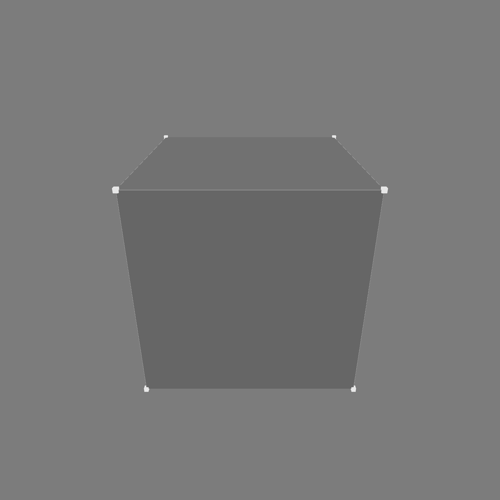
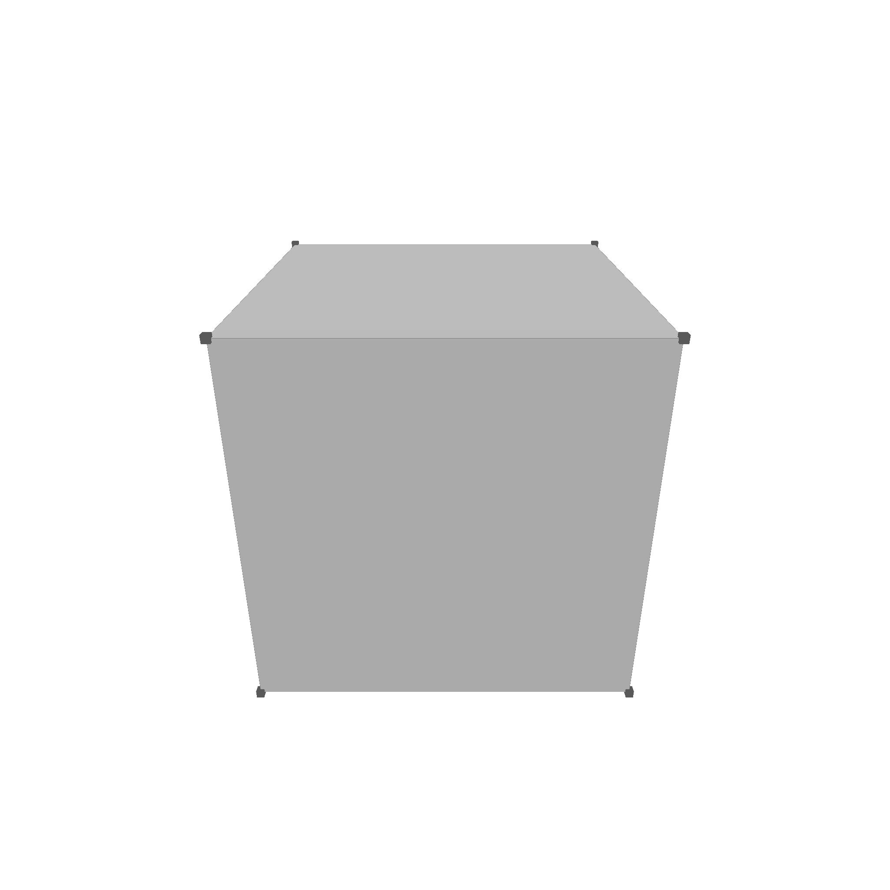

# Kernel Architecture

The overall kernel architecture is shown in the following figure:

- `geop-algebra` Implements the basic algebraic operations in interval arithmetic, like EFloat64 (extended Float, with upper and lower boundary), Polynomials, BSplines, Nurbs, or other algebraic expressions.
- `geop-geometry`: Implements "unbounded" sets, curves, surfaces, points, etc. This can be a plane, a sphere, a circle, or a line.
- `geop-topology`: Implements "bounded" sets, like edges, faces, volumes.
- `geop-rasterize`: Implements rasterization algorithms that convert topological objects into triangle list, that can be rendered by a GPU.
- `geop-wgpu`: Uses the rasterizaed data and renders it using the `wgpu` crate.
- `modern-brep-kernel-book`: This book.

## Dark vs light mode

The kernel can be used in both dark and light mode. The following figure shows the difference between the two modes:

