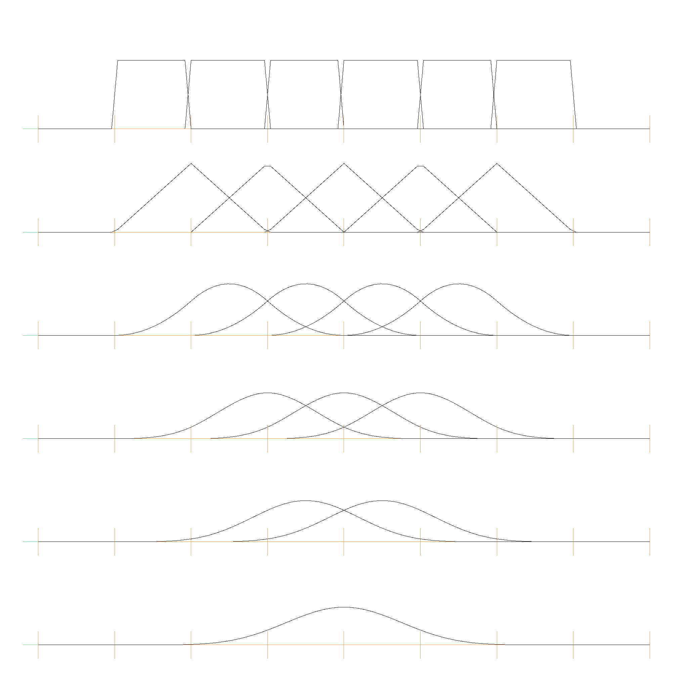
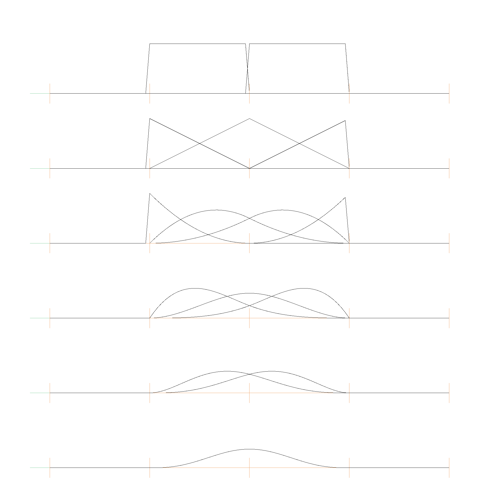

# B Splines

B-Splines are slightly different from Bernstein Polynomials and Bezier Curves.

The B-Spline basis functions are defined recursively as follows:

$$
N_{i,0}(t) = \begin{cases} 1 & \text{if } t_i \leq t < t_{i+1}\\\ 0 & \text{otherwise} \end{cases}
$$

$$
N_{i,k}(t) = \frac{t - t_i}{t_{i+k} - t_i} N_{i,k-1}(t) + \frac{t_{i+k+1} - t}{t_{i+k+1} - t_{i+1}} N_{i+1,k-1}(t)
$$

where \\(t_i\\) are the knot values. The know values can be strictly increasing or non-decreasing. Here is an example for strictly increasing knot values [0, 1, 2, 3, 4, 5, 6, 7]:

And here is one for non-decreasing knot values [0, 0, 0, 1, 2, 2, 2]:

A b-spline curve is defined as:

$$
C(t) = \sum_{i=0}^{n} P_i N_{i,k}(t)
$$

where \\(P_i\\) are the control points.

