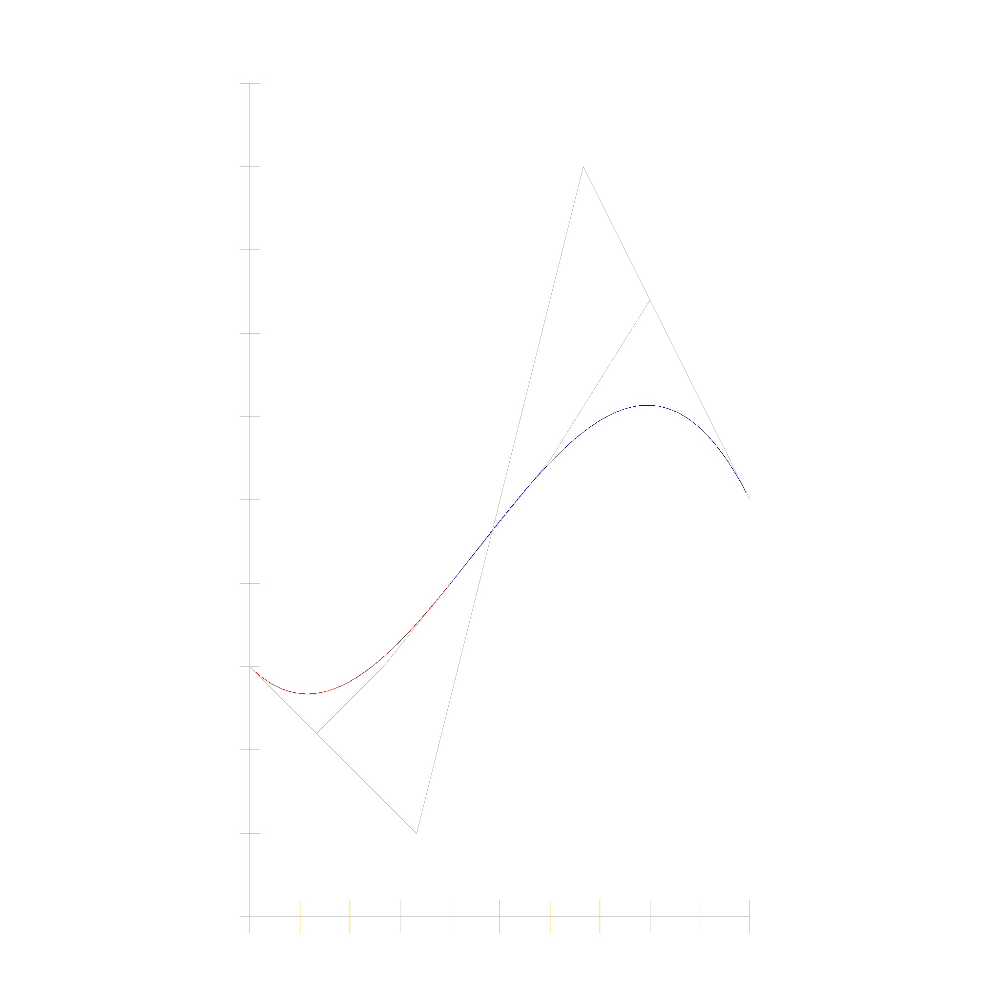
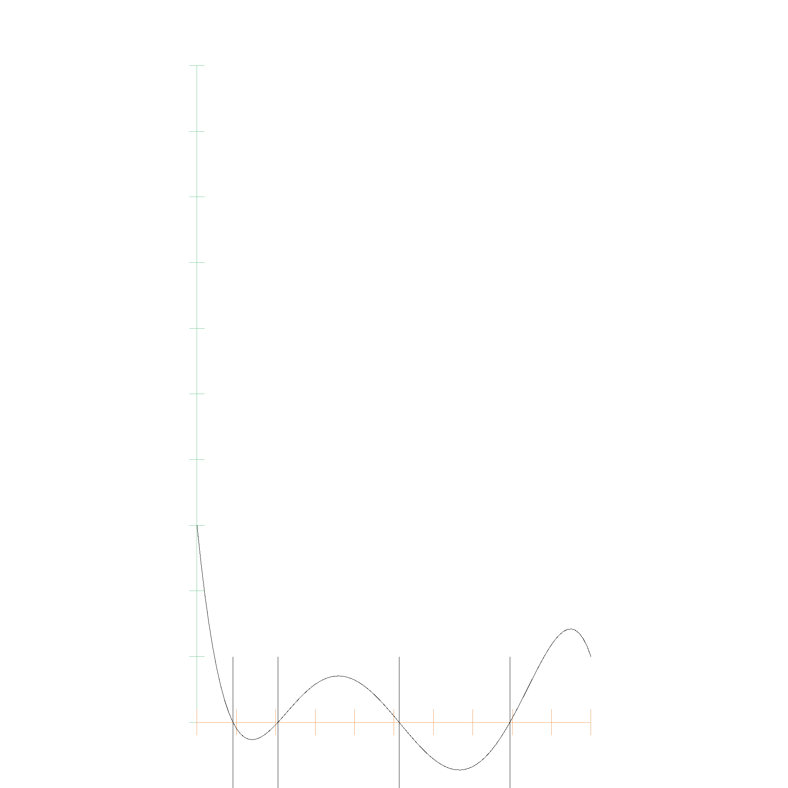
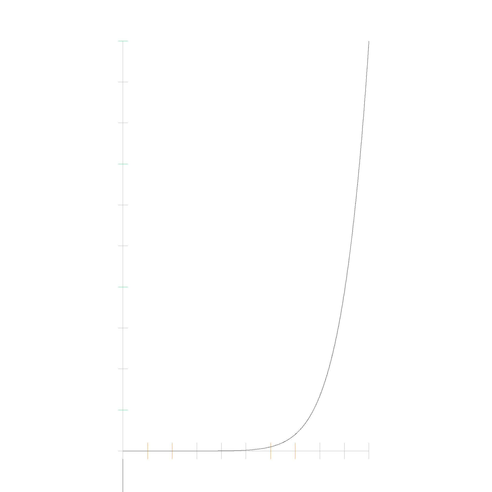
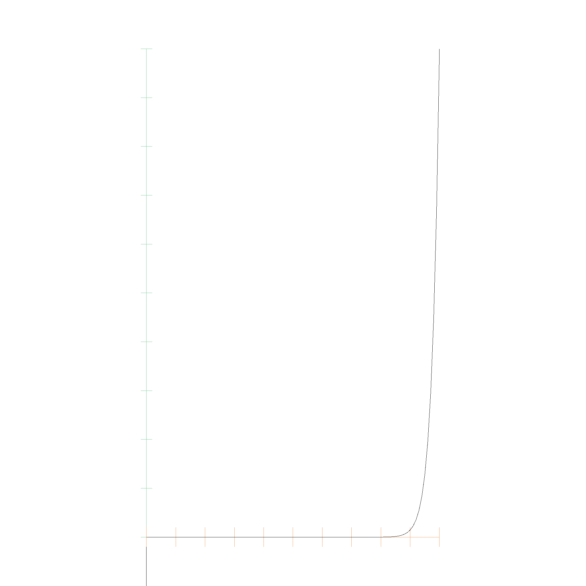
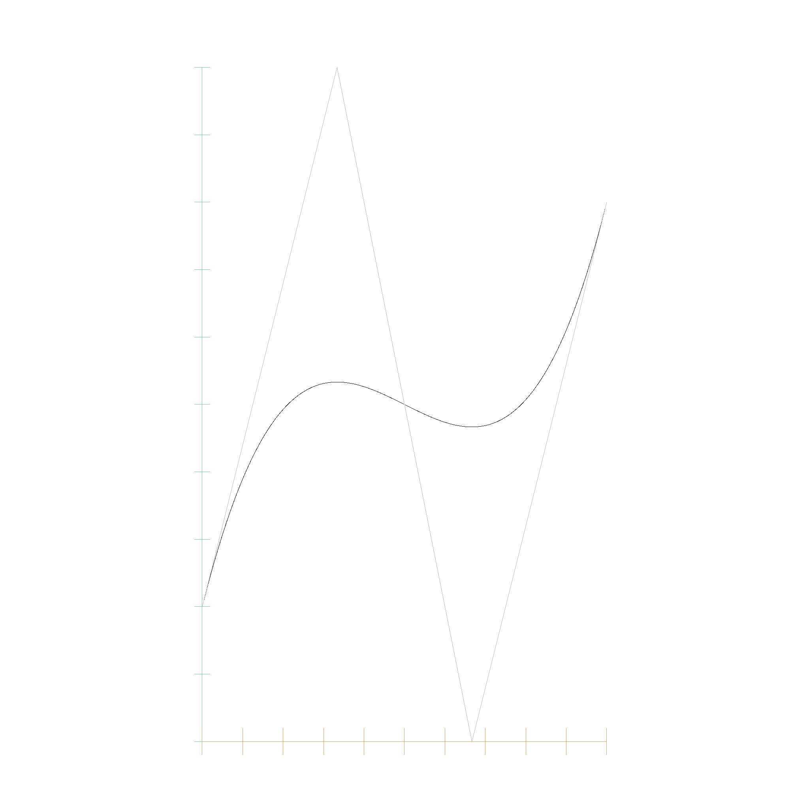

# Bernstein Polynomials

A polynom in Bernstein representation is of the form $$p(x) = \sum_{i=0}^n a_i B_{i,n}(x)$$, with the basis functions being defined as $$B_{i,n}(x) = \binom{n}{i} x^i (1-x)^{n-i}$$. The Bernstein representation is a list of coefficients, where the coefficients are multiplied with the Bernstein basis functions. The following code snippet shows the `BernsteinPolynom` struct:

```rust
pub struct BernsteinPolynomial<T> {
    coefficients: Vec<T>,
}
```

Every polynomial can be converted from monomial to Bernstein representation and back. Bernstein Polynomials have better numerical properties than monomial polynomials, and are therefore used in many geometric algorithms.

Here is a picture of the Basis functions from \\(B_{0, 0}\\) (top) to \\(B_{0, 5}\\)...\\(B_{5, 5}\\) (bottom):


This table lists the polynomial functions \\( B_{i,j}(x) \\):

| \\( B_{i,j}(x) \\)  | Expression |
|-------------------|------------|
| \\( B_{0,0}(x) \\)  | \\( 1.00 \cdot x^0 \\) |
| \\( B_{0,1}(x) \\)  | \\( -1.00 \cdot x^1 + 1.00 \cdot x^0 \\) |
| \\( B_{1,1}(x) \\)  | \\( 1.00 \cdot x^1 \\) |
| \\( B_{0,2}(x) \\)  | \\( 1.00 \cdot x^2 - 2.00 \cdot x^1 + 1.00 \cdot x^0 \\) |
| \\( B_{1,2}(x) \\)  | \\( -2.00 \cdot x^2 + 2.00 \cdot x^1 \\) |
| \\( B_{2,2}(x) \\)  | \\( 1.00 \cdot x^2 \\) |
| \\( B_{0,3}(x) \\)  | \\( -1.00 \cdot x^3 + 3.00 \cdot x^2 - 3.00 \cdot x^1 + 1.00 \cdot x^0 \\) |
| \\( B_{1,3}(x) \\)  | \\( 3.00 \cdot x^3 - 6.00 \cdot x^2 + 3.00 \cdot x^1 \\) |
| \\( B_{2,3}(x) \\)  | \\( -3.00 \cdot x^3 + 3.00 \cdot x^2 \\) |
| \\( B_{3,3}(x) \\)  | \\( 1.00 \cdot x^3 \\) |
| \\( B_{0,4}(x) \\)  | \\( 1.00 \cdot x^4 - 4.00 \cdot x^3 + 6.00 \cdot x^2 - 4.00 \cdot x^1 + 1.00 \cdot x^0 \\) |
| \\( B_{1,4}(x) \\)  | \\( -4.00 \cdot x^4 + 12.00 \cdot x^3 - 12.00 \cdot x^2 + 4.00 \cdot x^1 \\) |
| \\( B_{2,4}(x) \\)  | \\( 6.00 \cdot x^4 - 12.00 \cdot x^3 + 6.00 \cdot x^2 \\) |
| \\( B_{3,4}(x) \\)  | \\( -4.00 \cdot x^4 + 4.00 \cdot x^3 \\) |
| \\( B_{4,4}(x) \\)  | \\( 1.00 \cdot x^4 \\) |
| ...               | ...        |

Many people forget that Bernstein Polynomials are defined on the entire real number range, not just on the interval \\([0, 1]\\). This means we could extrapolate far beyond the control points, but they spiral out of control quite quickly. However, monomial polynomials are also defined on the entire real number range, so it is nice that we can approximate them entirely with a couple control points.

And this is the Bernstein polynomial with coefficients `0.0, 0.6, 0.1, 0.8, 0.3`:


## Algorithms for polynomials in Bernstein form

There is a great research paper called [Algorithms for polynomials in Bernstein form by R.T. Farouki and V.T. Rajan](https://www.sciencedirect.com/science/article/pii/0167839688900167). Most of the following algorithms are based on this paper, which we will quote as `Farouki 1988`.

## Conversion between Monomial and Bernstein

If a polynomial of degree \\(n\\) is given in monomial form and Bernstein form as

$$ P(x) = \sum_{i=0}^n c_i x^i = \sum_{i=0}^n a_{i} B_{i,n}(x) $$

then the coefficients are related by

$$ c_i = \sum_{k=0}^i (-1)^{i - k} \binom{n}{i} \binom{i}{k} a_{k} $$

and

$$ a_i = \sum_{k=0}^i \frac{\binom{i}{k}}{\binom{n}{k}} c_k $$

(Equation 3 `Farouki 1988`). For example, for \\(n=4\\), the factors for converting to monomial are

```
1.00e0
-4.00e0 4.00e0
6.00e0  -1.20e1 6.00e0
-4.00e0 1.20e1  -1.20e1 4.00e0
1.00e0  -4.00e0 6.00e0  -4.00e0 1.00e0
```

and for converting to Bernstein are

```
1.00e0
1.00e0  2.50e-1
1.00e0  5.00e-1 1.67e-1
1.00e0  7.50e-1 5.00e-1 2.50e-1
1.00e0  1.00e0  1.00e0  1.00e0  1.00e0
```

## Evaluation of Bernstein Polynomials

The evaluation of a Bernstein polynomial is done by the de Casteljau algorithm. The de Casteljau algorithm is a recursive algorithm that evaluates a polynomial at a given point. The algorithm is based on the fact that the Bernstein basis functions are recursively defined. The algorithm is as follows:

```rust
impl<T> BernsteinPolynomial<T> {
    fn eval(&self, t: EFloat64) -> T {
        let mut beta = self.coefficients.clone();
        let n = beta.len();
        for j in 1..n {
            for k in 0..n - j {
                beta[k] = beta[k].clone() * (EFloat64::one() - t.clone())
                    + beta[k + 1].clone() * t.clone();
            }
        }
        beta[0].clone()
    }
}
```

This is described in Wikipedia.

## Subdivision

Interestingly, the betas which are computed in the de Casteljau algorithm can also be used to subdivide the polynomial. The [MIT Course](https://web.mit.edu/hyperbook/Patrikalakis-Maekawa-Cho/node13.html) has a nice visualization of this process.

The betas form a pyramid, where the base (left in the image) is the original polynomial, and the top (right in the image) is the polynomial evaluated at \\(t\\). The subdivision is done by taking the left border of the pyramid and the right border of the pyramid, which are the two polynomials evaluated at \\(t\\), and the middle border, which is the polynomial evaluated at \\(t/2\\). Here you can see how the polynomial is subdivided into two polynomials, the red and the blue one:



## Root finding

Here comes the fun part: Now that we can subdivide a bernstein polynomial, we can use it to find roots. Using [Bézout's theorem](https://en.wikipedia.org/wiki/B%C3%A9zout%27s_theorem), we know that a polynomial has either infinitely many roots, or a finite number of roots. 

- If the polynomial has infinitely many roots, then the polynomial is the zero polynomial.
- Otherwise, the polynomial has a finite number of roots.

Next, we use the convex hull property of Bernstein Polynomials. The convex hull of a Bernstein Polynomial is the convex hull of the control points. If the convex hull of the control points does not contain the x-axis, then the polynomial has no roots. If the convex hull has both positive and negative y-values, then the polynomial may have roots.

This results in a very simple algorithm to find the roots of a polynomial in interval arithmetic:
- Check if the coefficients are all definetly positive or all negative. If they are, then the polynomial has no roots.
- Otherwise, subdivide the polynomial in the middle into left and right side:
    - If for one side, all coefficients contain 0, we have reached the limits of numerical precision and can return the interval as a root.
    - Otherwise, subdivide the polynomial again.
    - When merging the roots of two subdivided intervals, we have to check if the last root of the left interval overlaps with the first root of the right interval. If they overlap, then we have to merge them into one root.

The nice part is, that this algorithm does not require an initial guess, or some predetermined accuracy for stopping the algorithm. The algorithm will always find all roots, and will always find the roots with the highest possible accuracy, and will make sure that a single root is not counted multiple times.



```console
Root: EFloat64 { upper_bound: 0.09129127973297148, lower_bound: 0.09129127973297078 }
Root: EFloat64 { upper_bound: 0.20542974361061986, lower_bound: 0.20542974361061803 }
Root: EFloat64 { upper_bound: 0.5130593945291194, lower_bound: 0.5130593945291179 }
Root: EFloat64 { upper_bound: 0.7941467075365286, lower_bound: 0.7941467075365266 }
```

This algorithm converges fast, even for nasty polynomials. This, for example is a polynomial with the first 9 coefficients being 0.0, and the 10th coefficient being 1.0:

```console
running 1 test
t_min: 0, t_max: 1
t_min: 0, t_max: 0.5
t_min: 0, t_max: 0.25
t_min: 0, t_max: 0.125
t_min: 0, t_max: 0.0625
t_min: 0, t_max: 0.03125
t_min: 0, t_max: 0.015625
t_min: 0, t_max: 0.0078125
t_min: 0, t_max: 0.00390625
t_min: 0, t_max: 0.001953125
t_min: 0, t_max: 0.0009765625
t_min: 0, t_max: 0.00048828125
t_min: 0, t_max: 0.000244140625
t_min: 0, t_max: 0.0001220703125
t_min: 0, t_max: 0.00006103515625
t_min: 0, t_max: 0.000030517578125
t_min: 0, t_max: 0.0000152587890625
t_min: 0, t_max: 0.00000762939453125
t_min: 0, t_max: 0.000003814697265625
t_min: 0, t_max: 0.0000019073486328125
t_min: 0, t_max: 0.00000095367431640625
t_min: 0, t_max: 0.000000476837158203125
t_min: 0, t_max: 0.0000002384185791015625
t_min: 0, t_max: 0.00000011920928955078125
t_min: 0, t_max: 0.00000005960464477539063
t_min: 0, t_max: 0.000000029802322387695313
t_min: 0, t_max: 0.000000014901161193847656
t_min: 0, t_max: 0.000000007450580596923828
t_min: 0, t_max: 0.000000003725290298461914
t_min: 0, t_max: 0.000000001862645149230957
t_min: 0, t_max: 0.0000000009313225746154785
t_min: 0, t_max: 0.0000000004656612873077393
t_min: 0, t_max: 0.00000000023283064365386963
t_min: 0, t_max: 0.00000000011641532182693481
t_min: 0, t_max: 0.00000000005820766091346741
t_min: 0, t_max: 0.000000000029103830456733704
t_min: 0, t_max: 0.000000000014551915228366852
t_min: 0, t_max: 0.000000000007275957614183426
t_min: 0, t_max: 0.000000000003637978807091713
t_min: 0, t_max: 0.0000000000018189894035458565
t_min: 0, t_max: 0.0000000000009094947017729282
t_min: 0, t_max: 0.0000000000004547473508864641
t_min: 0, t_max: 0.00000000000022737367544323206
t_min: 0, t_max: 0.00000000000011368683772161603
t_min: 0, t_max: 0.00000000000005684341886080802
t_min: 0, t_max: 0.00000000000002842170943040401
t_min: 0, t_max: 0.000000000000014210854715202004
t_min: 0, t_max: 0.000000000000007105427357601002
t_min: 0, t_max: 0.000000000000003552713678800501
t_min: 0, t_max: 0.0000000000000017763568394002505
t_min: 0, t_max: 0.0000000000000008881784197001252
t_min: 0, t_max: 0.0000000000000004440892098500626
t_min: 0, t_max: 0.0000000000000002220446049250313
t_min: 0, t_max: 0.00000000000000011102230246251565
t_min: 0, t_max: 0.00000000000000005551115123125783
t_min: 0, t_max: 0.000000000000000027755575615628914
t_min: 0, t_max: 0.000000000000000013877787807814457
t_min: 0, t_max: 0.000000000000000006938893903907228
t_min: 0, t_max: 0.000000000000000003469446951953614
t_min: 0, t_max: 0.000000000000000001734723475976807
t_min: 0, t_max: 0.0000000000000000008673617379884035
t_min: 0, t_max: 0.0000000000000000004336808689942018
t_min: 0, t_max: 0.0000000000000000002168404344971009
t_min: 0, t_max: 0.00000000000000000010842021724855044
t_min: 0, t_max: 0.00000000000000000005421010862427522
t_min: 0, t_max: 0.00000000000000000002710505431213761
t_min: 0, t_max: 0.000000000000000000013552527156068805
t_min: 0, t_max: 0.000000000000000000006776263578034403
t_min: 0, t_max: 0.0000000000000000000033881317890172014
t_min: 0, t_max: 0.0000000000000000000016940658945086007
t_min: 0, t_max: 0.0000000000000000000008470329472543003
t_min: 0, t_max: 0.0000000000000000000004235164736271502
t_min: 0, t_max: 0.0000000000000000000002117582368135751
t_min: 0, t_max: 0.00000000000000000000010587911840678754
t_min: 0, t_max: 0.00000000000000000000005293955920339377
t_min: 0, t_max: 0.000000000000000000000026469779601696886
t_min: 0, t_max: 0.000000000000000000000013234889800848443
t_min: 0, t_max: 0.000000000000000000000006617444900424222
t_min: 0, t_max: 0.000000000000000000000003308722450212111
t_min: 0, t_max: 0.0000000000000000000000016543612251060553
t_min: 0, t_max: 0.0000000000000000000000008271806125530277
t_min: 0, t_max: 0.00000000000000000000000041359030627651384
t_min: 0, t_max: 0.00000000000000000000000020679515313825692
t_min: 0, t_max: 0.00000000000000000000000010339757656912846
t_min: 0, t_max: 0.00000000000000000000000005169878828456423
t_min: 0, t_max: 0.000000000000000000000000025849394142282115
t_min: 0, t_max: 0.000000000000000000000000012924697071141057
t_min: 0, t_max: 0.000000000000000000000000006462348535570529
t_min: 0, t_max: 0.0000000000000000000000000032311742677852644
t_min: 0, t_max: 0.0000000000000000000000000016155871338926322
t_min: 0, t_max: 0.0000000000000000000000000008077935669463161
t_min: 0, t_max: 0.00000000000000000000000000040389678347315804
t_min: 0, t_max: 0.00000000000000000000000000020194839173657902
t_min: 0, t_max: 0.00000000000000000000000000010097419586828951
t_min: 0, t_max: 0.00000000000000000000000000005048709793414476
t_min: 0, t_max: 0.00000000000000000000000000002524354896707238
t_min: 0, t_max: 0.00000000000000000000000000001262177448353619
t_min: 0, t_max: 0.000000000000000000000000000006310887241768095
t_min: 0, t_max: 0.0000000000000000000000000000031554436208840472
t_min: 0, t_max: 0.0000000000000000000000000000015777218104420236
t_min: 0, t_max: 0.0000000000000000000000000000007888609052210118
t_min: 0, t_max: 0.0000000000000000000000000000003944304526105059
t_min: 0, t_max: 0.00000000000000000000000000000019721522630525295
t_min: 0, t_max: 0.00000000000000000000000000000009860761315262648
t_min: 0, t_max: 0.00000000000000000000000000000004930380657631324
t_min: 0, t_max: 0.00000000000000000000000000000002465190328815662
t_min: 0, t_max: 0.00000000000000000000000000000001232595164407831
t_min: 0, t_max: 0.000000000000000000000000000000006162975822039155
t_min: 0, t_max: 0.0000000000000000000000000000000030814879110195774
t_min: 0, t_max: 0.0000000000000000000000000000000015407439555097887
t_min: 0, t_max: 0.0000000000000000000000000000000007703719777548943
t_min: 0, t_max: 0.0000000000000000000000000000000003851859888774472
t_min: 0, t_max: 0.0000000000000000000000000000000001925929944387236
t_min: 0, t_max: 0.0000000000000000000000000000000000962964972193618
t_min: 0, t_max: 0.0000000000000000000000000000000000481482486096809
t_min: 0, t_max: 0.00000000000000000000000000000000002407412430484045
t_min: 0, t_max: 0.000000000000000000000000000000000012037062152420224
t_min: 0, t_max: 0.000000000000000000000000000000000006018531076210112
t_min: 0, t_max: 0.000000000000000000000000000000000003009265538105056
```




The following one is even nastier, with 39 coefficients being 0.0, and the 40th coefficient being 1.0. The algorithm stops faster, as its running into numerical limitations faster. This results in the root being less accurate, but still as accurate as possible with the given floating point precision:

```console
t_min: 0, t_max: 1
t_min: 0, t_max: 0.5
t_min: 0, t_max: 0.25
t_min: 0, t_max: 0.125
t_min: 0, t_max: 0.0625
t_min: 0, t_max: 0.03125
t_min: 0, t_max: 0.015625
t_min: 0, t_max: 0.0078125
t_min: 0, t_max: 0.00390625
t_min: 0, t_max: 0.001953125
t_min: 0, t_max: 0.0009765625
t_min: 0, t_max: 0.00048828125
t_min: 0, t_max: 0.000244140625
t_min: 0, t_max: 0.0001220703125
t_min: 0, t_max: 0.00006103515625
t_min: 0, t_max: 0.000030517578125
t_min: 0, t_max: 0.0000152587890625
t_min: 0, t_max: 0.00000762939453125
t_min: 0, t_max: 0.000003814697265625
t_min: 0, t_max: 0.0000019073486328125
t_min: 0, t_max: 0.00000095367431640625
t_min: 0, t_max: 0.000000476837158203125
t_min: 0, t_max: 0.0000002384185791015625
t_min: 0, t_max: 0.00000011920928955078125
t_min: 0, t_max: 0.00000005960464477539063
t_min: 0, t_max: 0.000000029802322387695313
t_min: 0, t_max: 0.000000014901161193847656
```




## Degree Elevation

Equation 27 of `Farouki 1988` describes how to elevate the degree of a Bernstein polynomial. The new coefficients are given by

$$ c_i^{n+r} = \sum_{j = max(0, i - r)}^{min(n, i)} \frac{\binom{r}{i - j} \binom{n}{j}}{\binom{n + r}{i}} c_i^n $$

Here is an example of degree elevation from degree 1 to 3:

```
Bernstein Polynomial: 1.00e0 B_{0,1}(t) + 2.00e0 B_{1,1}(t)
Elevated Bernstein Polynomial: 1.00e0 B_{0,2}(t) + 1.50e0 B_{1,2}(t) + 2.00e0 B_{2,2}(t)
Elevated Bernstein Polynomial 2: 1.00e0 B_{0,3}(t) + 1.33e0 B_{1,3}(t) + 1.67e0 B_{2,3}(t) + 2.00e0 B_{3,3}(t)
```


# Bezier curves

If we use a Bernstein Polynomial with Points instead of EFloats for the coefficients, we get a Bezier Curve.


