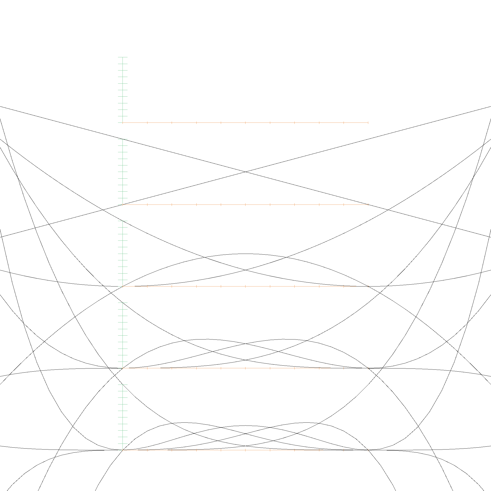
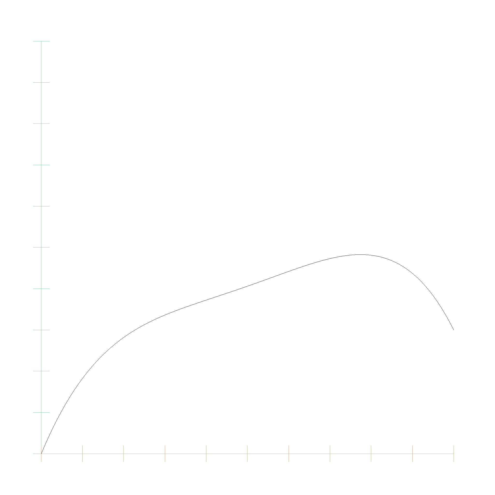

# Bernstein Polynomials

A polynom in Bernstein representation is of the form $$p(x) = \sum_{i=0}^n a_i B_{i,n}(x)$$, with the basis functions being defined as $$B_{i,n}(x) = \binom{n}{i} x^i (1-x)^{n-i}$$. The Bernstein representation is a list of coefficients, where the coefficients are multiplied with the Bernstein basis functions. The following code snippet shows the `BernsteinPolynom` struct:

```rust
pub struct BernsteinPolynomial<T> {
    coefficients: Vec<T>,
}
```

Every polynomial can be converted from monomial to Bernstein representation and back. Bernstein Polynomials have better numerical properties than monomial polynomials, and are therefore used in many geometric algorithms.

Here is a picture of the Basis functions from \\(B_{0, 0}\\) (top) to \\(B_{0, 5}\\)...\\(B_{5, 5}\\) (bottom):



This table lists the polynomial functions \\( B_{i,j}(x) \\):

| \\( B_{i,j}(x) \\)  | Expression |
|-------------------|------------|
| \\( B_{0,0}(x) \\)  | \\( 1.00 \cdot x^0 \\) |
| \\( B_{0,1}(x) \\)  | \\( -1.00 \cdot x^1 + 1.00 \cdot x^0 \\) |
| \\( B_{1,1}(x) \\)  | \\( 1.00 \cdot x^1 \\) |
| \\( B_{0,2}(x) \\)  | \\( 1.00 \cdot x^2 - 2.00 \cdot x^1 + 1.00 \cdot x^0 \\) |
| \\( B_{1,2}(x) \\)  | \\( -2.00 \cdot x^2 + 2.00 \cdot x^1 \\) |
| \\( B_{2,2}(x) \\)  | \\( 1.00 \cdot x^2 \\) |
| \\( B_{0,3}(x) \\)  | \\( -1.00 \cdot x^3 + 3.00 \cdot x^2 - 3.00 \cdot x^1 + 1.00 \cdot x^0 \\) |
| \\( B_{1,3}(x) \\)  | \\( 3.00 \cdot x^3 - 6.00 \cdot x^2 + 3.00 \cdot x^1 \\) |
| \\( B_{2,3}(x) \\)  | \\( -3.00 \cdot x^3 + 3.00 \cdot x^2 \\) |
| \\( B_{3,3}(x) \\)  | \\( 1.00 \cdot x^3 \\) |
| \\( B_{0,4}(x) \\)  | \\( 1.00 \cdot x^4 - 4.00 \cdot x^3 + 6.00 \cdot x^2 - 4.00 \cdot x^1 + 1.00 \cdot x^0 \\) |
| \\( B_{1,4}(x) \\)  | \\( -4.00 \cdot x^4 + 12.00 \cdot x^3 - 12.00 \cdot x^2 + 4.00 \cdot x^1 \\) |
| \\( B_{2,4}(x) \\)  | \\( 6.00 \cdot x^4 - 12.00 \cdot x^3 + 6.00 \cdot x^2 \\) |
| \\( B_{3,4}(x) \\)  | \\( -4.00 \cdot x^4 + 4.00 \cdot x^3 \\) |
| \\( B_{4,4}(x) \\)  | \\( 1.00 \cdot x^4 \\) |
| ...               | ...        |

Many people forget that Bernstein Polynomials are defined on the entire real number range, not just on the interval \\([0, 1]\\). This means we could extrapolate far beyond the control points, but they spiral out of control quite quickly. However, monomial polynomials are also defined on the entire real number range, so it is nice that we can approximate them entirely with a couple control points.

And this is the Bernstein polynomial with coefficients `0.0, 0.6, 0.1, 0.8, 0.3`:



## Algorithms for polynomials in Bernstein form

There is a great research paper called [Algorithms for polynomials in Bernstein form by R.T. Farouki and V.T. Rajan](https://www.sciencedirect.com/science/article/pii/0167839688900167). Most of the following algorithms are based on this paper, which we will quote as `Farouki 1988`.

## Conversion between Monomial and Bernstein

If a polynomial of degree \\(n\\) is given in monomial form and Bernstein form as

$$ P(x) = \sum_{i=0}^n c_i x^i = \sum_{i=0}^n a_{i} B_{i,n}(x) $$

then the coefficients are related by

$$ c_i = \sum_{k=0}^i (-1)^{i - k} \binom{n}{i} \binom{i}{k} a_{k} $$

and

$$ a_i = \sum_{k=0}^i \frac{\binom{i}{k}}{\binom{n}{k}} c_k $$

(Equation 3 `Farouki 1988`). For example, for \\(n=4\\), the factors for converting to monomial are

```
1.00e0
-4.00e0 4.00e0
6.00e0  -1.20e1 6.00e0
-4.00e0 1.20e1  -1.20e1 4.00e0
1.00e0  -4.00e0 6.00e0  -4.00e0 1.00e0
```

and for converting to Bernstein are

```
1.00e0
1.00e0  2.50e-1
1.00e0  5.00e-1 1.67e-1
1.00e0  7.50e-1 5.00e-1 2.50e-1
1.00e0  1.00e0  1.00e0  1.00e0  1.00e0
```

## Evaluation of Bernstein Polynomials

The evaluation of a Bernstein polynomial is done by the de Casteljau algorithm. The de Casteljau algorithm is a recursive algorithm that evaluates a polynomial at a given point. The algorithm is based on the fact that the Bernstein basis functions are recursively defined. The algorithm is as follows:

```rust
impl<T> BernsteinPolynomial<T> {
    fn eval(&self, t: EFloat64) -> T {
        let mut beta = self.coefficients.clone();
        let n = beta.len();
        for j in 1..n {
            for k in 0..n - j {
                beta[k] = beta[k].clone() * (EFloat64::one() - t.clone())
                    + beta[k + 1].clone() * t.clone();
            }
        }
        beta[0].clone()
    }
}
```

This is described in Wikipedia.

## Degree Elevation

Equation 27 of `Farouki 1988` describes how to elevate the degree of a Bernstein polynomial. The new coefficients are given by

$$ c_i^{n+r} = \sum_{j = max(0, i - r)}^{min(n, i)} \frac{\binom{r}{i - j} \binom{n}{j}}{\binom{n + r}{i}} c_i^n $$

Here is an example of degree elevation from degree 1 to 3:

```
Bernstein Polynomial: 1.00e0 B_{0,1}(t) + 2.00e0 B_{1,1}(t)
Elevated Bernstein Polynomial: 1.00e0 B_{0,2}(t) + 1.50e0 B_{1,2}(t) + 2.00e0 B_{2,2}(t)
Elevated Bernstein Polynomial 2: 1.00e0 B_{0,3}(t) + 1.33e0 B_{1,3}(t) + 1.67e0 B_{2,3}(t) + 2.00e0 B_{3,3}(t)
```

