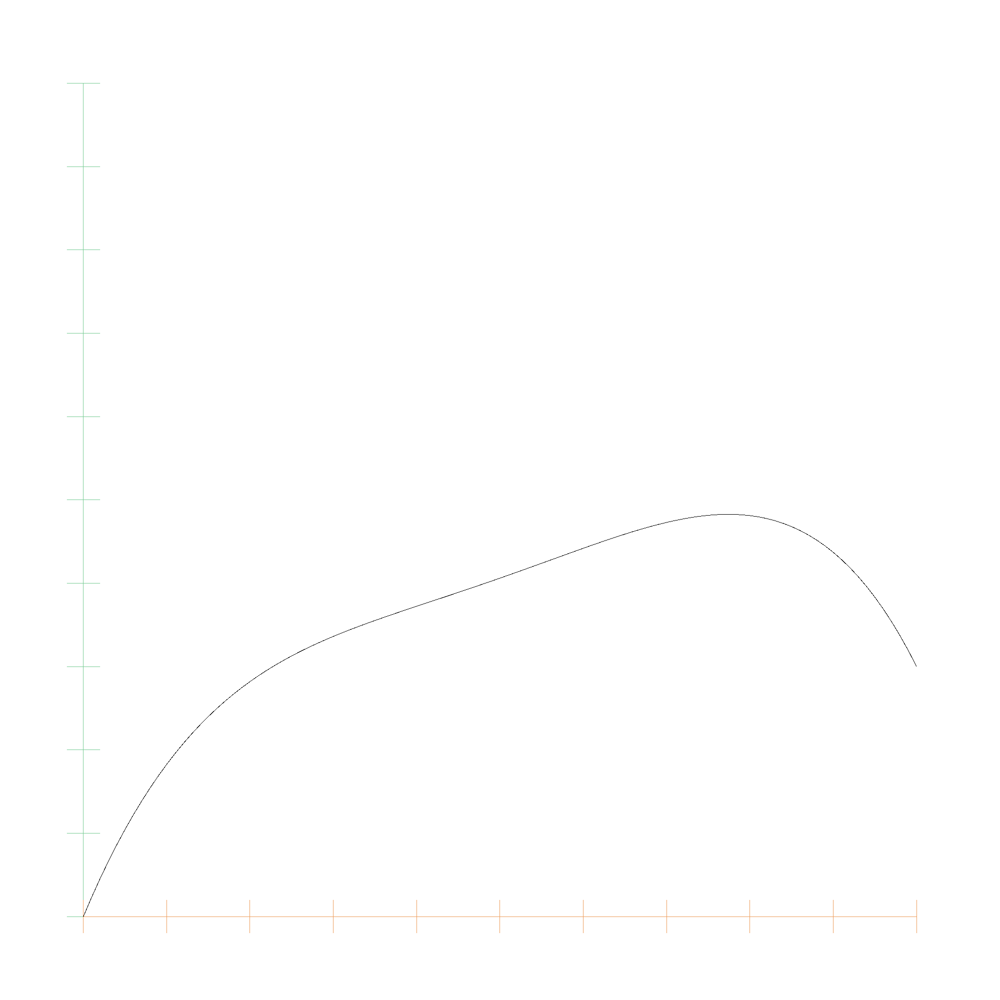

# Bernstein Polynomials

A polynom in Bernstein representation is of the form $$p(x) = \sum_{i=0}^n a_i B_{i,n}(x)$$, with the basis functions being defined as $$B_{i,n}(x) = \binom{n}{i} x^i (1-x)^{n-i}$$. The Bernstein representation is a list of coefficients, where the coefficients are multiplied with the Bernstein basis functions. The following code snippet shows the `BernsteinPolynom` struct:

```rust
pub struct BernsteinPolynomial<T> {
    coefficients: Vec<T>,
}
```

Every polynomial can be converted from monomial to Bernstein representation and back. Bernstein Polynomials have better numerical properties than monomial polynomials, and are therefore used in many geometric algorithms.

Here is a picture of the Basis functions \\(B_{0, 5}\\) to \\(B_{5, 5}\\):


And this is the Bernstein polynomial with coefficients `0.0, 0.6, 0.1, 0.8, 0.3`:



