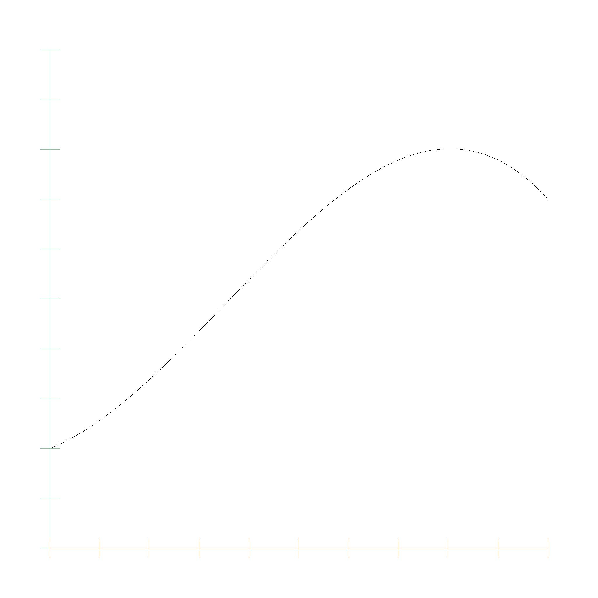

# Monomial Polynomials

A polynom in monomial representation is of the form $$p(x) = a_0 + a_1 x + a_2 x^2 + \ldots + a_n x^n$$. The monomial representation is a simple list of coefficients. The following code snippet shows the `MonomialPolynom` struct:

```rust
pub struct MonomialPolynom {
    pub monomials: Vec<EFloat64>,
}
```

We can add and multiply these polynomials, and use them as algebraic expressions for lines, circles, and so on. This is the plot for

$$p(x) = 0.2 + 0.4 x + 1.8 x^2 -1.7 x^3$$



