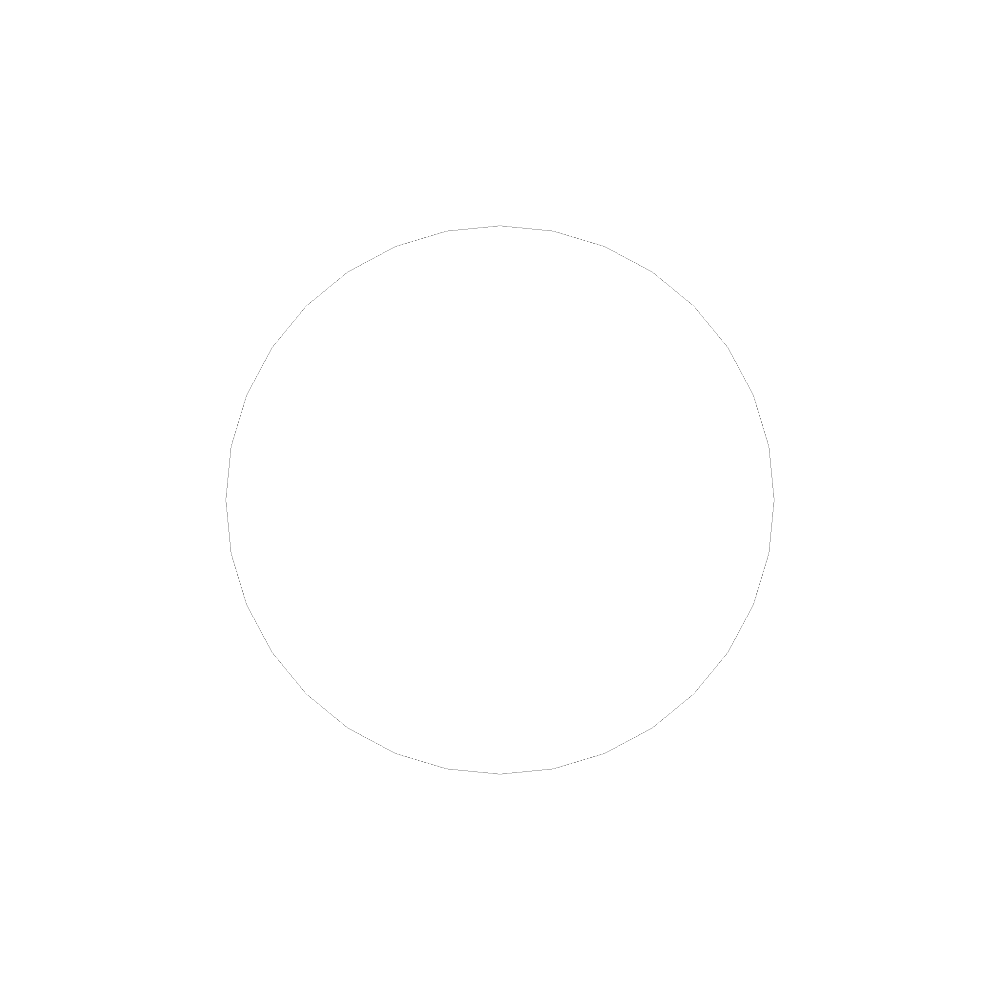

# Geometry

Geometry refers to structures that represent unbounded / inifinite objects, like planes, spheres, circles, lines, etc. These objects are used to define the shape of the objects in the scene. The simples case are curves.

> **Note**: For rendering, we have to somehow bound the geometry, as we cannot render infinite objects. Just ignore the points and the boundaries of the surfaces.

## Curves

A curve is something that could be thought of as a function that maps a number to a point in space. Right now, geop implements only two primitive curves. This is a line, defined by a basis and a direction.

```rust
let line = Line::new(
    Point3::new(0.0, 0.0, 0.0),
    Vector3::new(1.0, 1.0, 1.0),
);
```


Next is a circle, defined by a center, a normal and a radius. The radius is a point, indicating where the circle starts or is at 0.

```rust
let circle = Circle::new(
    Point3::new(0.0, 0.0, 0.0),
    Vector3::new(0.0, 0.0, 1.0),
    1.0,
);
```



## Do not expose the parameters

So technically, all the curves are something like $$c(u): \mathbb{R} \rightarrow \mathbb{R}^3, u \rightarrow p$$. But we don't want to use the parameters, as they are not very dangerous and misleading in general. For example, imagine writing a function that checks if a point is in an interval. You would write something like this:

```rust
// Checks if p is between a and b
fn is_in_interval(p: Point3, a: Point3, b: Point3) -> bool {
    let u_p = unproject(p);
    let u_a = unproject(a);
    let u_b = unproject(b);
    u_p >= u_a && u_p <= u_b
}
```

However, this code does not work for a circle. A circle has no unique mapping from $p$ to $u$. So, we have to avoid using the parameters. This is why the curves do not expose the parameters. 

## How to interact with curves

How do we interact with curves? We can do this by using the `Curve` trait. It implements the following methods:

