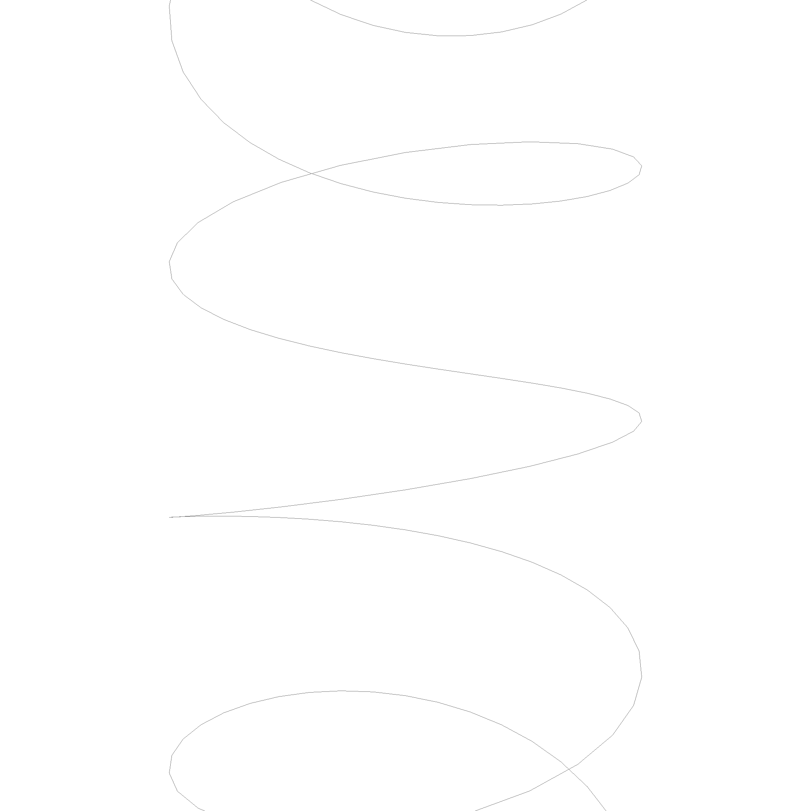
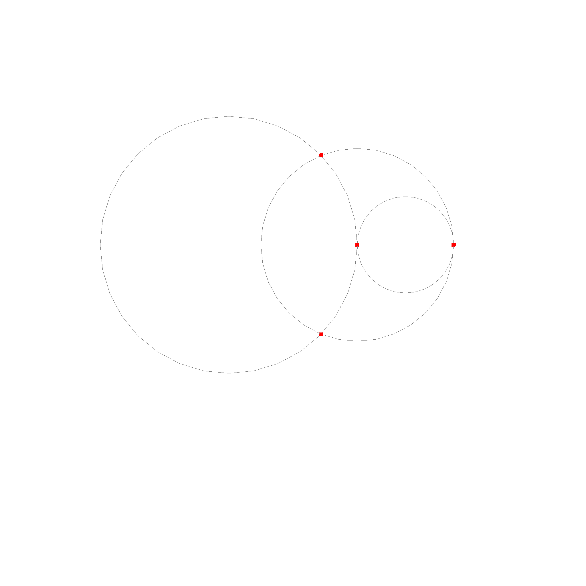
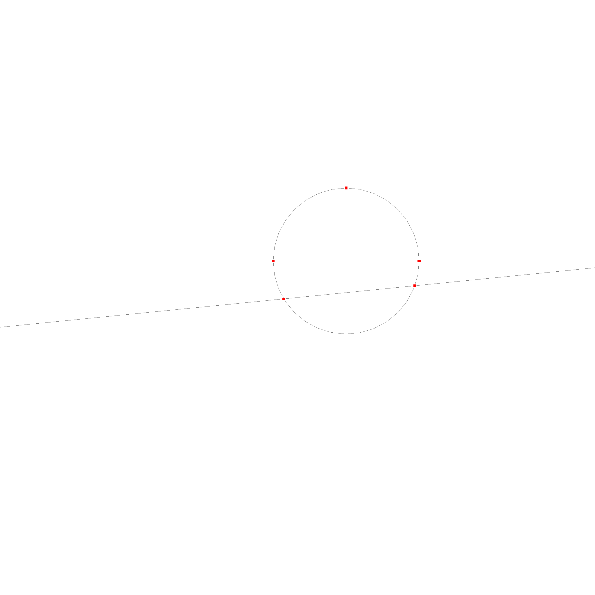

# Curves

A curve is something that could be thought of as a function that maps a number to a point in space. Right now, geop implements only two primitive curves. This is a line, defined by a basis and a direction.

```rust
let line = Line::new(
    Point3::new(0.0, 0.0, 0.0),
    Point3::new(1.0, 0.0, 0.0),
);
```


Next is a circle, defined by a center, a normal and a radius. The radius is a point, indicating where the circle starts or is at 0.

```rust
let circle = Circle::new(
    Point3::new(0.0, 0.0, 0.0),
    Point3::new(0.0, 0.0, 1.0),
    1.0,
);
```


There is an ellipsis.

```rust
let ellipsis = Ellipsis::new(
    Point3::new(0.0, 0.0, 0.0),
    Point3::new(0.0, 1.0, 0.0),
    Point3::new(1.0, 0.0, 0.0),
    Point3::new(0.0, 0.0, 1.0),
);
```


There are also more interesting curves, like a Helix.

```rust
let helix = Helix::new(
    Point3::new(0.0, 0.0, 0.0),
    Point3::new(0.0, 0.0, 1.0),
    Point3::new(1.0, 0.0, 0.0),
);
```



### Do not expose the parameters

Technically, all the curves are something like $$c(u): \mathbb{R} \rightarrow \mathbb{R}^3, u \rightarrow p$$ But we don't want to use the parameters, as they are very dangerous and misleading in general. For example, imagine writing a function that checks if a point is in an interval. You would write something like this:

```rust
// Checks if p is between a and b
fn is_in_interval(p: Point3, a: Point3, b: Point3) -> bool {
    let u_p = unproject(p);
    let u_a = unproject(a);
    let u_b = unproject(b);
    u_p >= u_a && u_p <= u_b
}
```

However, this code does not work for a circle. A circle has no unique mapping from \\(p\\) to \\(u\\). So, we have to avoid using the parameters. This is why the curves do not expose the parameters. 

### How to interact with curves

How do we interact with curves? We can do this by using the `Curve` trait. It implements the following methods:

```rust
// Transform
pub fn transform(&self, transform: Transform) -> Curve;

// Change the direction of the curve
pub fn neg(&self) -> Curve;

// Normalized Tangent / Direction of the curve at the given point.
pub fn tangent(&self, p: Point) -> Point;

// Checks if point is on the curve.
pub fn on_curve(&self, p: Point) -> bool;

// Interpolate between start and end at t. t is between 0 and 1.
pub fn interpolate(&self, start: Option<Point>, end: Option<Point>, t: f64) -> Point;

// Checks if m is between x and y. m==x and m==y are true.
pub fn between(&self, m: Point, start: Option<Point>, end: Option<Point>) -> bool;

// Get the midpoint between start and end.
// This will guarantee that between(start, midpoint, end) is true and midpoint != start and midpoint != end.
// If start or end is None, the midpoint is a point that is a unit distance away from the other point.
pub fn get_midpoint(&self, start: Option<Point>, end: Option<Point>) -> Point;

// Finds the closest point on the curve to the given point.
pub fn project(&self, p: Point) -> Point;
```

These are all the methods that have to be used to interact with curves. You might notice, that `interpolate`, `between` and `get_midpoint` functions accept `Optional`. This is for cases where we work with infinite edges. For example, a line that starts somewhere and goes to infinity would work with `start = Some(Point3::new(0.0, 0.0, 0.0))` and `end = None`. Circles also frequently don't have a start and end point.


## Intersections

Intersections are fully supported between all curves. Keep in mind, that intersections are not always a single point. For example, two lines can intersect in one point, but they can also intersect in infinitely many points if they are the same line, or in no points if they are parallel. This is represented by the enum data type that is returned by the intersection function.

```rust
#[derive(Debug)]
pub enum CircleCircleIntersection {
    Circle(Circle),
    TwoPoint(Point, Point),
    OnePoint(Point),
    None,
}

pub fn circle_circle_intersection(a: &Circle, b: &Circle) -> CircleCircleIntersection;
```

Interestingly, there are no cases where the intersection of two curves results in a curve and a point.

> **Note**: The intersection of two curves is EITHER a curve OR a list of points OR nothing. There is no case where the intersection is a curve and a point, or a bounded curve.

```rust
pub enum CurveCurveIntersection {
    None,
    Points(Vec<Point>),
    Curve(Curve),
}

pub fn curve_curve_intersection(edge_self: &Curve, edge_other: &Curve) -> CurveCurveIntersection;
```

This property also extends to more complicated geometries like nurbs and means these datastructures are well closed under intersection. This also explains why they reside in their own crate. We use this property many times later in the topology modules.

Here is an example of the intersection of multiple lines with each other. The intersections are red, the lines are black. Two black lines overlap each other and result in a red line. The other lines intersect only in the red points.


These are the intersection cases for circles. The circles are black, the intersections are red. Two circles overlap and result in a circle. Two other circles intersect in two points. The last case is where the circles just touch each other and intersect in one point.



The last case is the intersection of a line and a circle.



For ellipses, we use a numerical method to find the intersections.


> **Note**: Implementation detail. The individual cases are implemented as `circle_circle_intersection`, `circle_line_intersection` and `line_line_intersection`. They are not a part of class, since it would not be clear in which class they should reside. We list them in alphabetical order.
> Then there is the `Curve` enum and a `curve_curve_intersection` function, which can be used for the general case. The `Curve` enum is used to represent the different cases of the intersection.
