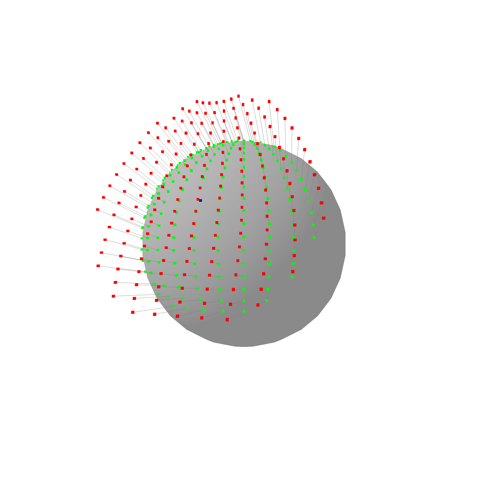
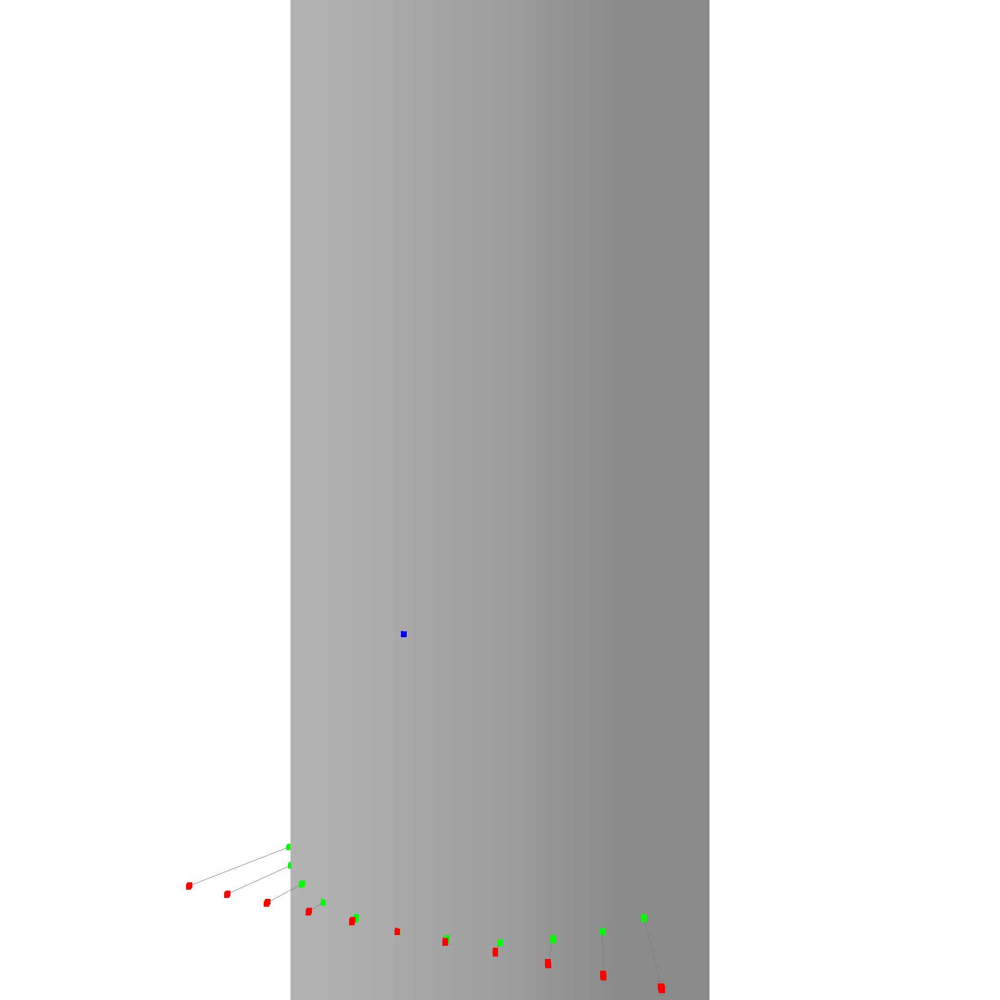

# Surfaces

In this chapter, we will discuss the representation of surfaces in the context of B-rep modeling. Surfaces include planes and spheres so far.

This is a plane, defined by a basis and 2 directions.

```rust
let plane = Plane::new(basis, u_slope, v_slope);
```


Next is a sphere, defined by a center and a radius, and if the normal is facing outwards.

```rust
let sphere = Sphere::new(basis, radius, true);
```


There is also a cylinder, which is defined by a basis, an extent direction, and a radius. The cylinder is infinite in the extent direction.

```rust
let cylinder = Cylinder::new(basis, extent, radius);
```


## Interacting with Surfaces

How do we interact with surfaces? We can do this by using the `Surface` trait. It implements the following methods:

```rust
// Transforms the surface by the given transform.
pub fn transform(&self, transform: Transform) -> Surface;

// Change normal direction of the surface.
pub fn neg(&self) -> Surface;

// Returns the normal of the surface at point p.
pub fn normal(&self, p: Point) -> Point;

// Checks if the point p is on the surface.
pub fn on_surface(&self, p: Point) -> bool;

// Returns the Riemannian metric between u and v
pub fn metric(&self, x: Point, u: TangentPoint, v: TangentPoint) -> f64;

// Returns the Riemannian distance between x and y.
pub fn distance(&self, x: Point, y: Point) -> f64;

// Exponential of u at base x. u_z is ignored.
pub fn exp(&self, x: Point, u: TangentPoint) -> Point;

// Log of y at base x. Z coordinate is set to 0.
pub fn log(&self, x: Point, y: Point) -> Option<TangentPoint>;

// Parallel transport of v from x to y.
pub fn parallel_transport(
    &self,
    v: Option<TangentPoint>,
    x: Point,
    y: Point,
) -> Option<TangentPoint>;

// Returns the geodesic between p and q.
pub fn geodesic(&self, x: Point, y: Point) -> Curve;

// Returns a point grid on the surface, which can be used for visualization.
pub fn point_grid(&self, density: f64) -> Vec<Point>;

// Finds the closest point on the surface to the given point.
pub fn project(&self, point: Point) -> Point;
```

## Riemannian Manifolds

We model surfaces as Riemannian manifolds. A Riemannian manifold is a smooth manifold with a Riemannian metric. The Riemannian metric is a positive-definite symmetric bilinear form on the tangent space at each point that varies smoothly from point to point. The Riemannian metric allows us to measure distances and angles on the surface. If the inner product is 0, the vectors are orthogonal. If the inner product is positive, the vectors are aligned in the same direction. If the inner product is negative, the vectors are aligned in the opposite direction.

Dont be scared, there is a simple way to think about this. Riemannian manifolds allow us to convert 3d problems into 2d problems. Many algorithms like for example the ray check algorithm to check if a point is inside a face, or delauany triangulation, or the voronoi diagram, are much easier to implement in 2d. Using Riemannian manifolds, we can convert these problems into 2d problems, as long as we find a reference point where each point we are working with is "close enough" to.

### Geodesics

One very important function we need are geodesics. They are the shortest path between two points on the surface. We can use them to find the distance between two points, or to find the closest point on the surface to a given point.


Do you see how the lines connect the points in the shortest way possible while also following the surface exactly? Thats what geodesics are. They are supported for all surface types, take a look at the cylinder geodesic for example:


The geodesic of a cylinder is a helix.

### Exponential and Logarithmic Maps

Another feature we use very often are the exponential and logarithmic maps. Very roughly, we can use them to flatten out points on a 3D surface to a 2D plane, and then later to map them back to the surface. This is very useful for example when we want to rasterize a surface, or when we want to find the closest point on the surface to a given point.



> **Note**: For visualization purposes, the red points are shifted to the anchor point. In reality, the plane of the red points goes through the origin, not the anchor point.

Are you able to see how the green points on the sphere are mapped to the red points on a plane? The logarithmic map is the function that maps the red points back to the green points. The exponential map is the function that maps the green points to the red points. This is a very powerful tool to convert 3d problems into 2d problems.

The logarithmic map is not always defined. For example, the logarithmic map is not defined at the opposite pole of a sphere. In this case, the logarithmic map returns `None`. However, in close proximity to the anchor, the logarithmic map is well defined. Here is one more example of the logarithmic map:


