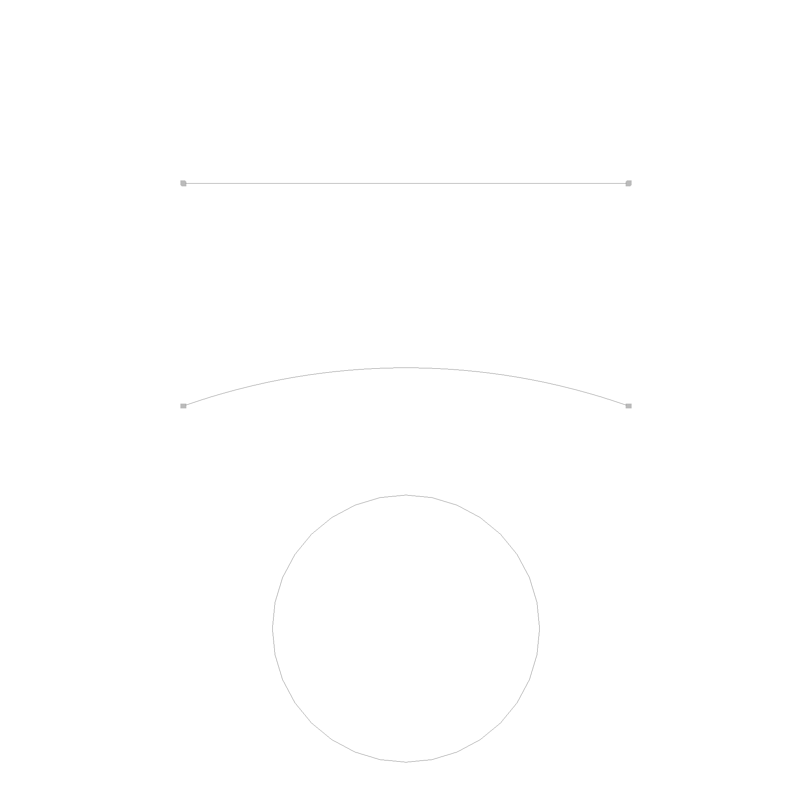

# Edges

An Edge is defined by a base curve, and a possible start and end point.

```rust
pub struct Edge {
    pub start: Option<Point>,
    pub end: Option<Point>,
    pub curve: Curve,
}
```

Here are some picture of various edges:



There is a line and a arc, which are bounded by start and end points. The circle is unbounded, so it has no start and end point.
