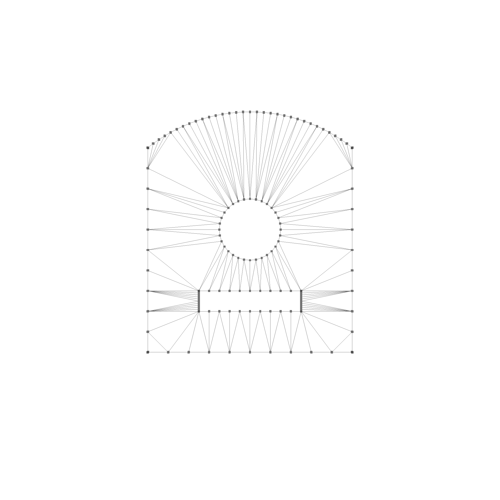
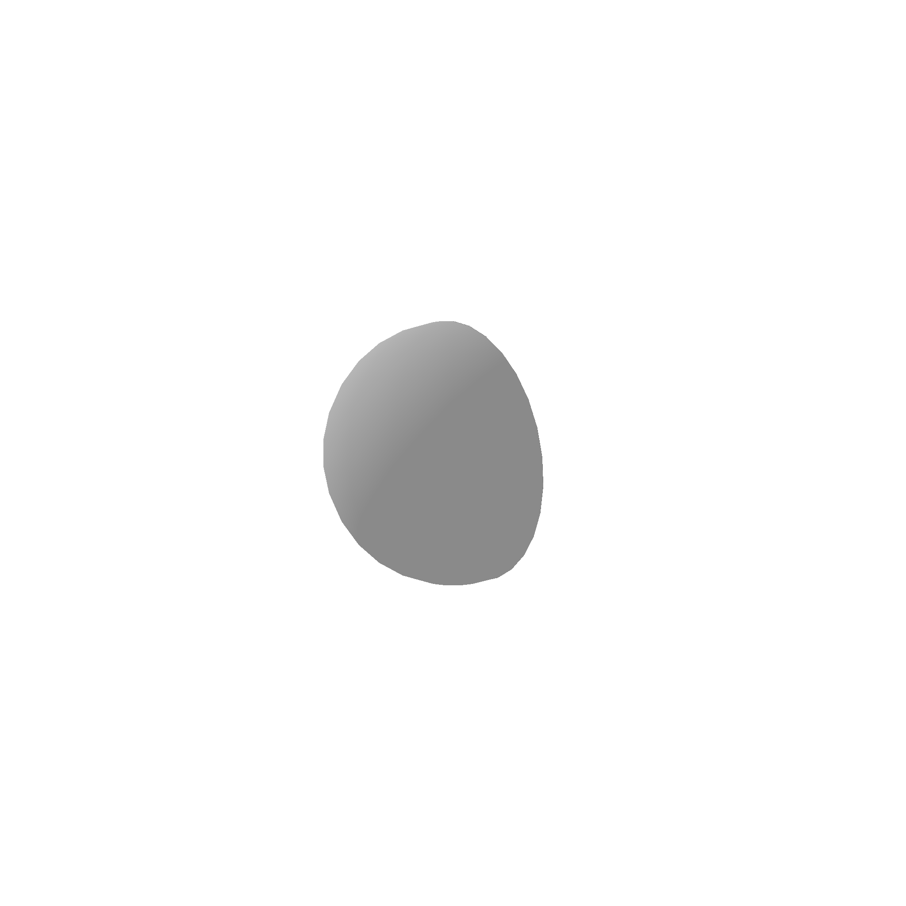
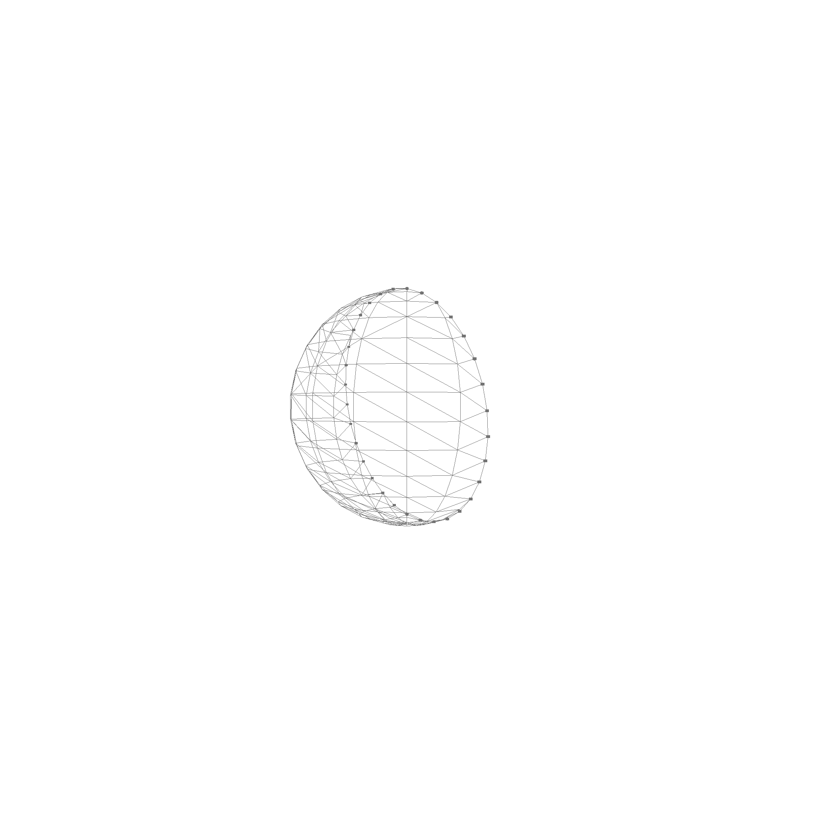
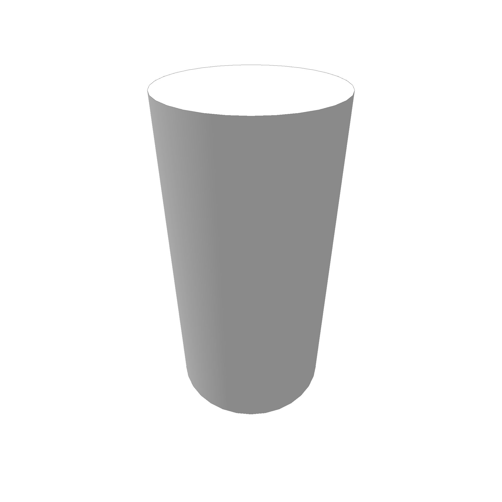
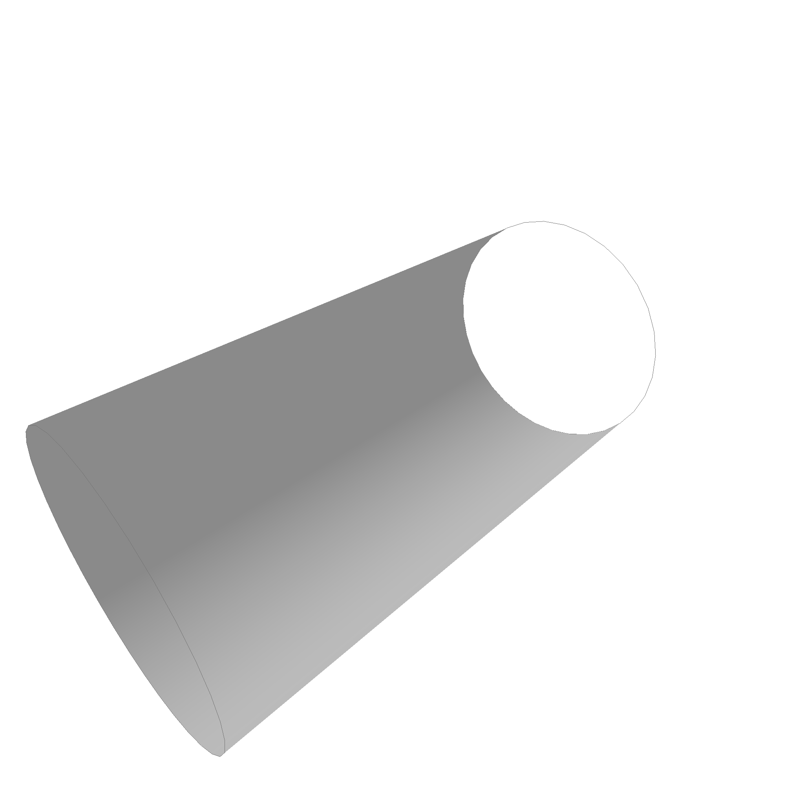

# Faces

Faces are defined by a surface, and some contours for boundaries.

```rust
pub struct Face {
    pub boundaries: Vec<Contour>,
    pub surface: Rc<Surface>,
}
```

> Wait a second... Shouldn't we have one outer boundary that is counter clockwise, and multiple holes that are clockwise. Yes, for simple shapes like planar cutouts this works, but it is in general not clear which ones of all the boundaries is the outer one. For example, if you have a cylinder, you can choose the top or the bottom as the outer boundary. This is why we have a list of boundaries, and the first one is the outer boundary. The only thing that is important is that the face is one continous patch of space, not multiple. This is assumed in the following algorithms.

A face can look something like this:


In wireframe mode, you see how the face is triangulated for rendering



Faces can also be non-planar, like this half sphere:



In wireframe mode, you see how the face is triangulated for rendering



Here are some cylinder faces. The cylinder is interesting, because it has a boundary and a hole, but we can choose which one is which. The top, or the bottom ring can be the boundary, with the other being the hole.




