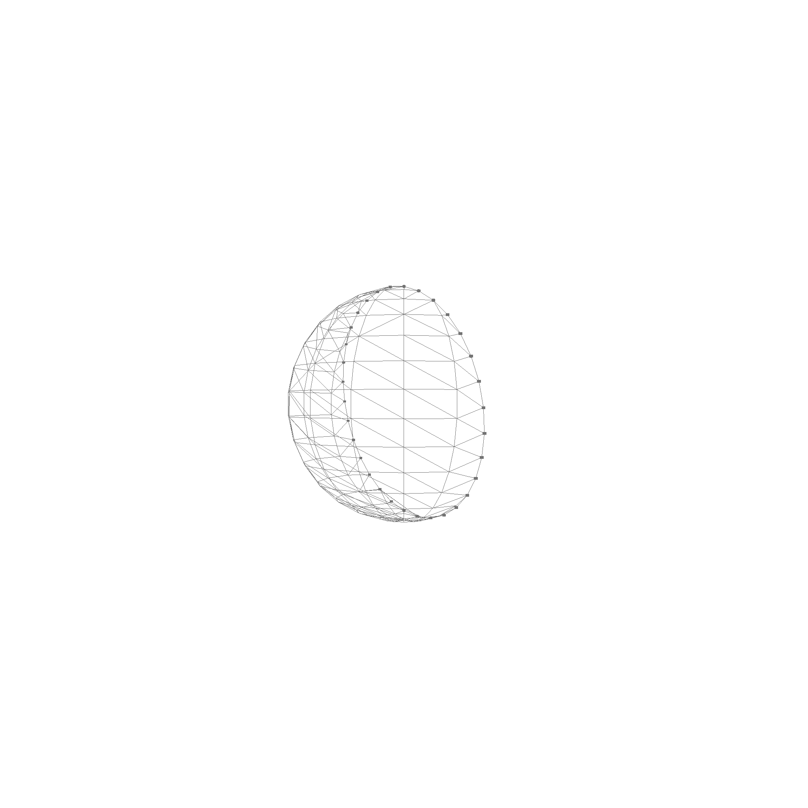

# Faces

Faces are defined by a surface, an optional boundary and a possible set of holes.

```rust
pub struct Face {
    pub boundary: Option<Contour>, // Coutner-clockwise
    pub holes: Vec<Contour>,       // Clockwise
    pub surface: Rc<Surface>,
}
```

A face can look something like this:


In wireframe mode, you see how the face is triangulated for rendering


Faces can also be non-planar, like this half sphere:


In wireframe mode, you see how the face is triangulated for rendering



