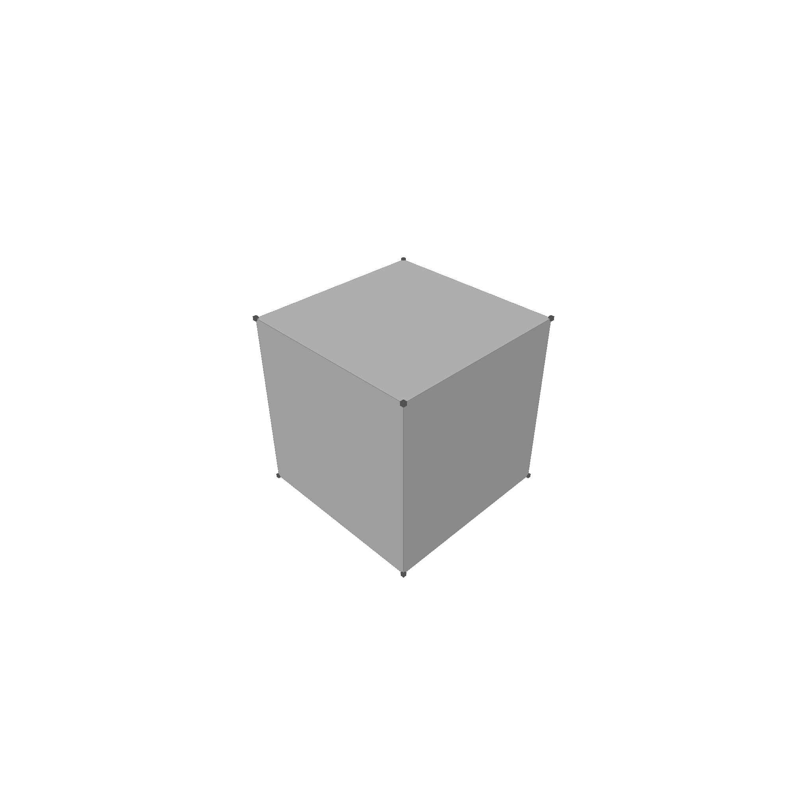

# Shells

Shells are a collection of faces that together form a closed space. They have to be watertight, meaning that there are no holes in the shell. This does not mean a shell cannot represent a drill hole, but that the inner side of the drill hole is also represented by a face.

```rust
pub struct Shell {
    pub faces: Vec<Face>,
}
```


