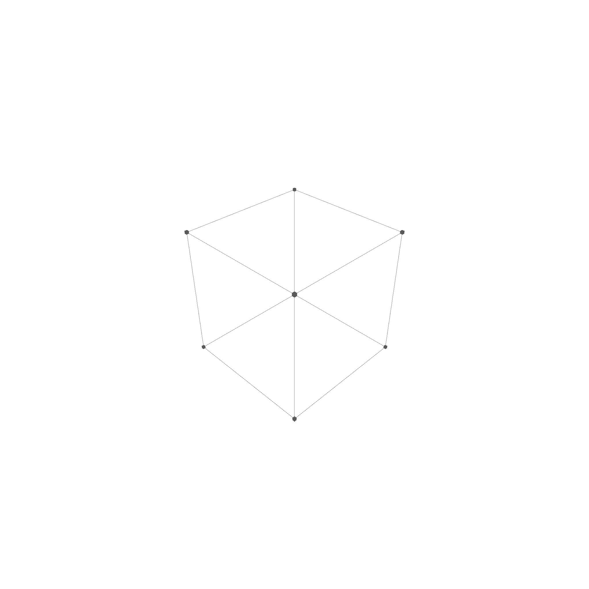

# Volumes

A volume defined by a shell, which is the boundary of the volume. Additionally, it can have cavities, which are also defined by a shell.

```rust
pub struct Volume {
    pub boundary: Shell,   // Normal pointing outwards
    pub cavities: Vec<Shell>, // Normal pointing inwards
}
```

Caveties are only visible in cross-section view, which is not yet implemented.


