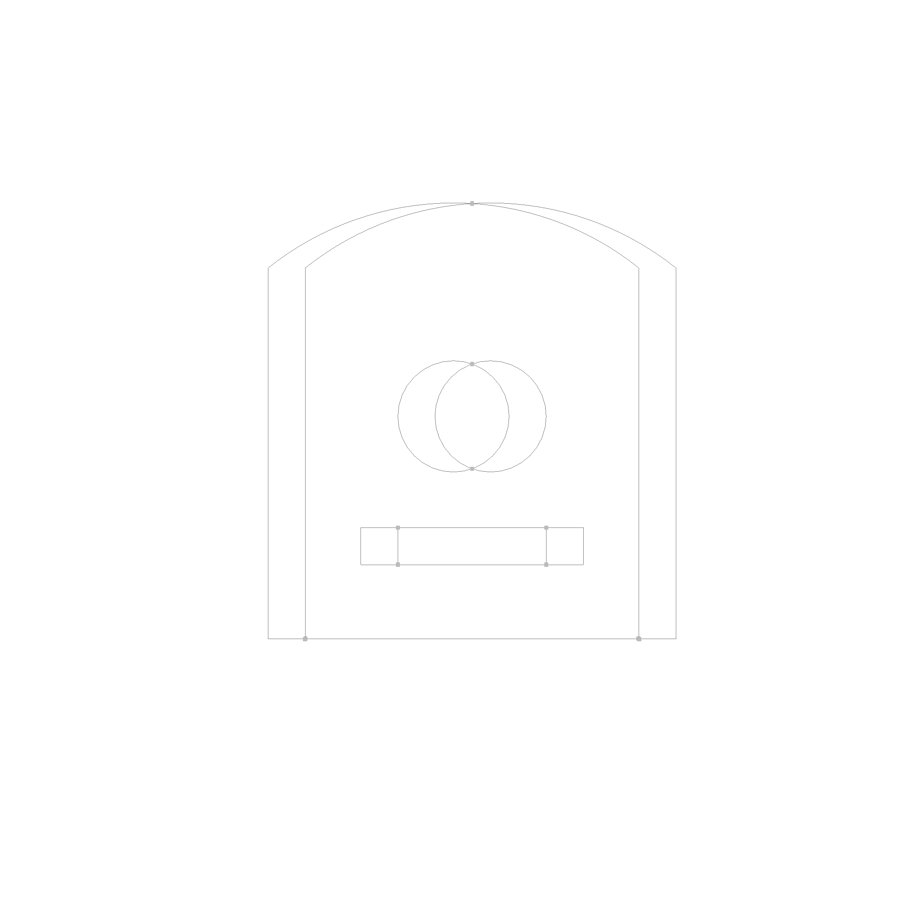
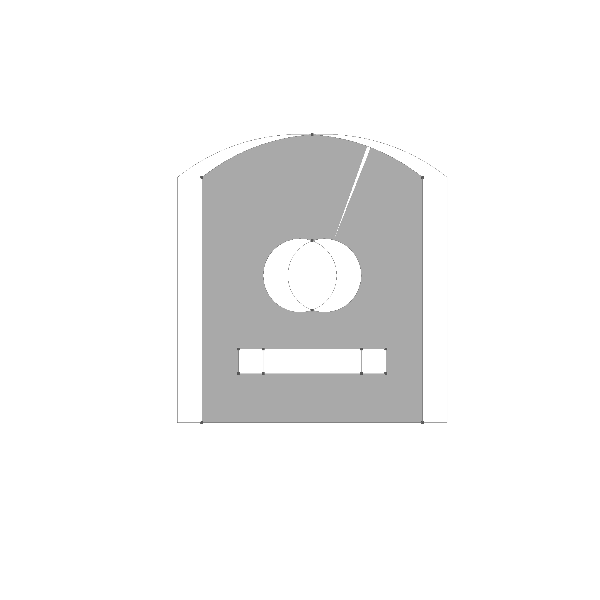

# Boolean Face Operations

2D boolean operations are fully supported.

The first step is to find all split points. These are points where the boundaries intersect, or start to intersect, or end to intersect.



The next step is to split the curves at these points into segments, which are then categorized into 8 categories. Based on these categories, the segments are then filtered out. Take for example the filter for the intersection function.

```rust
FaceSplit::AinB(_) => true,
FaceSplit::AonBSameSide(_) => true,
FaceSplit::AonBOpSide(_) => false,
FaceSplit::AoutB(_) => false,
FaceSplit::BinA(_) => true,
FaceSplit::BonASameSide(_) => false,
FaceSplit::BonAOpSide(_) => false,
FaceSplit::BoutA(_) => false,
```

By checking if the midpoint of each edge is inside, outside, or on the boundary of the other face, we can determine which edges have to stay for the intersection operation. The following picture shows each category in a different color in an exploded view.


Then the segments are reassembled into new contours. The contours are then sorted into a hierarchy and the faces are reassembled.


This is the result of the intersection operation.



This is the result of the union operation.


This is the result of the difference operation.


