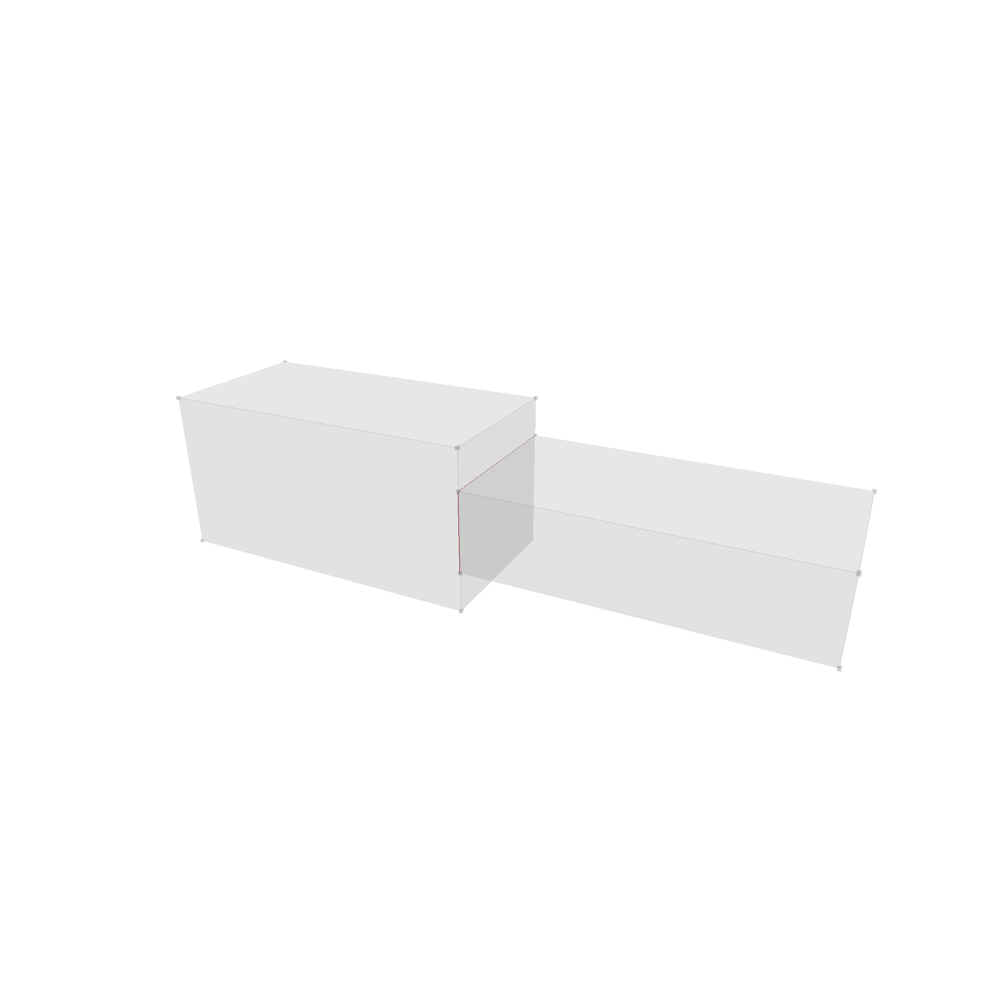

# Boolean Solid Operations

3D booleans work in a similar way to 2D booleans. The first step is to find all split edges. To find these, we compare each pair of Faces and find the intersection. If the intersection is a point, we ignore it. If the intersection is a line, we add it to the list of split edges. If the intersection is a face, all boundary edges are also added to the list of split edges.

In red, you can see the split edges. Due to clipping, only 2 of the 4 split edges are visible.

The next step is to split each face along all possible split edges. To do this, we iterate over all faces and edges, and split the face by the edge if necessary. This is the most complex part of the boolean operation. Some edge cases that have to be considered are:

- In general, we have to split the face boundaries at the start and end of the edge.
- Now the behavior depends on of the start and end of the edge actually lie on the face boundary.
    - If none lies on the boundary, a new hole is created.
    - If only one lies on the boundary, the boundary is extended with a new path back and forth.
    - If both lie on the boundary, it depends.
        - If its the same boundary, split it into two faces.
        - If its different boundaries, connect them back and forth, and make them one boundary.
